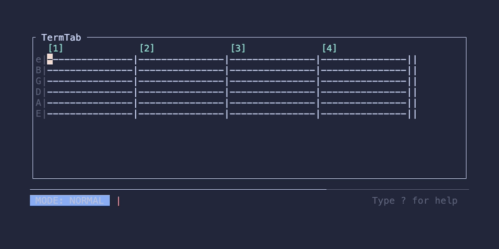

# TermTab



TermTab is a Vim-style terminal user interface for creating and editing guitar tabs. It treats musical tablature as a continuous stream of structural columns rather than a raw 2D text grid, allowing for precise editing, dynamic word-wrapping, and annotation tracking.

## Quick Start

You must provide a filename to launch TermTab. If the file doesn't exist, it will boot up with a fresh 4-measure canvas.

```bash
cargo run my_song.json
```

**Print Mode:**
You can bypass the interactive editor and dump the fully formatted tablature directly to your terminal's standard output using the `--print` flag.

```bash
cargo run -- --print my_song.json
```

## Architecture & Data Models

TermTab is built around a specialized data model that decouples the musical content from the visual layout.

### `TabDocument`
The core state of the editor. Rather than storing a massive 2D array of characters, the document is simply a 1D `Vec<TabColumn>`. This makes insertions, deletions, and undo/redo operations trivial and extremely reliable.

### `TabColumn`
A structural representation of a single vertical slice of time across all 6 strings. A column contains:
- An array of characters representing the state of each string (e.g., fret numbers, barlines, or hyphens).
- An optional text `annotation` bound specifically to that column.

Because annotations are intrinsically bound to their respective `TabColumn`, shifting columns natively shifts the annotations perfectly without any complex index management.

### Character Boxes
TermTab groups contiguous non-dash characters on a string (e.g., fret numbers like `12`, or slides like `12/`) into **Character Boxes**.
- **Isolation**: Constraints (like the maximum 2 consecutive digits rule) are applied strictly within each box, allowing adjacent numbers in separate boxes (e.g. `12` and `3`) without violations.
- **Note Translation**: Diatonic note mode translates each box independently. Adjacent numbers in separate boxes are not combined into single notes.

### Dynamic Rendering & Chunks
The TUI reads the 1D stream of columns and dynamically groups them into **chunks** that word-wrap based on your current terminal width. 
- **Double Barlines (`||`)**: If the word-wrapper detects two adjacent barlines, it will dynamically break the current visual block, giving you absolute control over measure layout.
- **Annotation Stacking**: If multiple columns within the same chunk contain long text annotations that overlap horizontally, the renderer automatically calculates and stacks them onto new vertical lines.

## Features

- **Vim-Style Navigation**: Navigate your tabs column-by-column using `h`/`l` (skipping barlines), jump box-by-box using `H`/`L`, or jump measure-by-measure using `w`, `e`, and `b`. Numeric prefixes are fully supported (e.g. type `5l` to jump 5 columns right).
- **Continuous Editing Modes**: Both Insert and Replace modes allow continuous editing across boxes. Pressing `Enter` automatically adjusts (shrinks) the box you left, jumps to the start of the next box, and keeps you in the editing mode.
- **Diatonic Note Mode**: Toggle note mode (`n`) to instantly translate all fret numbers into their corresponding diatonic note letters. Note translation is isolated to individual character boxes (adjacent numbers in separate boxes are not combined).
- **Key Signature Support**: Add textual annotations above columns (e.g., `Key: Bb Minor`). TermTab will intelligently adjust the note translation to use the appropriate sharps or flats for that specific key context moving forward.
- **Undo/Redo**: Complete snapshot-based state tracking.
- **Full File Persistence**: Projects save their entire state—including your cursor position and the complete undo/redo history—so you can pick up exactly where you left off.

## Command Cheatsheet

### Navigation (Normal Mode)
- `h, l`: Move cursor left/right column-by-column (skipping barlines).
- `j, k`: Move cursor down/up to adjacent strings.
- `H, L`: Move cursor left/right box-by-box (jumps to start of box, skipping barlines).
- `w`: Jump forward to the start of the next measure.
- `e`: Jump forward to the end of the current measure.
- `b`: Jump backward to the start of the current/previous measure.
- `]`, `[`: Jump the cursor down or up to the next/previous visual row.
- `[number][command]`: Prefix a command with a number to multiply it (e.g. `10j` or `4w`).

### Editing (Normal Mode)
- `i`: Enter Insert Mode (insert characters, expanding the box).
- `a`: Enter Append Mode (insert characters starting after the current character, or inside the box if empty/at start).
- `r`: Enter Replace Mode (continuous box-by-box replacement).
- `R`: Enter Continuous Overwrite Mode (column-by-column overwrite).
- `v`: Enter Visual Mode to highlight columns.
- `y`: Yank (Copy) the selected columns.
- `d` / `x`: Delete (Cut) the selected columns.
- `p`: Paste the clipboard at the cursor.
- `>` / `<`: Insert or delete a blank column at the cursor across all 6 strings.
- `A` (Shift+A): Open a prompt to type an annotation (e.g., chords, lyrics, or Key signatures).
- `n`: Toggle Note Mode.
- `u`: Undo the last action.
- `Ctrl+R`: Redo the last undone action.
- `?`: Open the Help popup.

### Insert & Replace Modes
Press `i` or `a` to enter Insert Mode, or `r` to enter Replace Mode.
- **Insert Mode**: Typing inserts characters, expanding the character box.
- **Replace Mode**: Typing replaces the character under the cursor.
- **Auto-Grow**: Typing on the last column of a box automatically appends `-` to the box, allowing you to type without overflowing into the next box.
- **Fret/Notation Rules**: Only valid digits and notation (`h`, `p`, `s`, `x`, `b`, `r`, `~`, `t`, `/`, `\`, `-`) are allowed. Consecutive digits are only combined within the same character box.
- **Navigation (Enter)**: Pressing `Enter` adjusts (shrinks) the box you just left to fit its content, moves the cursor to the start of the next box (skipping barlines, appending a measure if at the end), and **remains in the editing mode** for continuous entry.
- **Backspace**: Deletes the character before the cursor *within* the row, shifting subsequent characters in the box left and padding with `-` (preserving box size). It does not delete the entire column.
- **Exiting**: Press `Esc` to adjust the active box to fit its content and return to Normal mode.

### Command Mode
Press `:` in Normal Mode to open the command prompt.
- `:w` - Save the file.
- `:q` - Quit (warns if there are unsaved changes).
- `:q!` - Force quit and discard changes.
- `:wq` - Save and quit.
- `:<number>` - (e.g. `:120`) Instantly jump your cursor to the start of measure 120.
